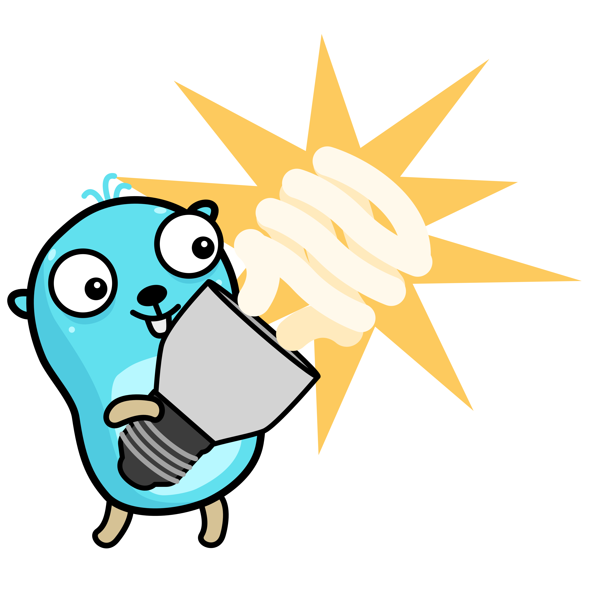

# Pong

A service uptime checker

## Project setup
1. Make sure you have go installed. You can get it [here](https://go.dev/doc/install)
2. Run `go mod download` 
3. Run `make` or if you want to use [air](https://github.com/air-verse/air) you will need to download air
4. Start server `go run cmd/pong/main.go`

## Docker updated! (not working at the moment):
1. build docker image`docker build -t pong .`
2. Create local db `duckdb local.db < sql/migrations/init.sql`
3. mount volume `docker run -v $(pwd)/local.db:/app/local.db -p 8080:8080 pong`
4. view duckdb `duckdb local.db --ui`